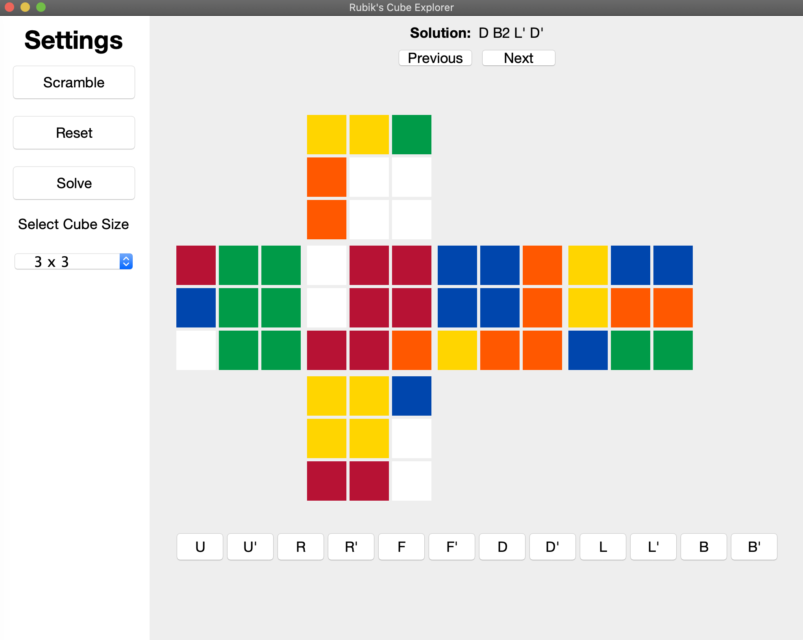
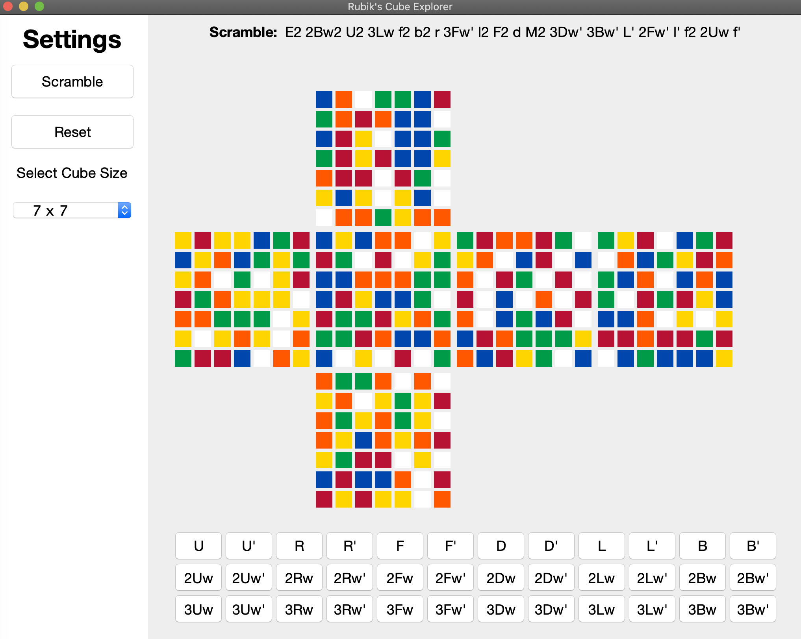

# CSE237-Project: Rubik's Cube Solver

Group Members: Brad Hodkinson, Pratyay Bishnupuri, Joe Frazier

## Usage
To use the program run the program, go to the main folder "project-rubikscubesovler" in your terminal and run ./start.sh
* Note - the algorithm may take awhile for cubes scrambled more than 5ish rotations.

## Iteration 3

**User stories completed this iteration**
* A user should be able to easily execute and run the program via an executable jar file.
* A user should be able to use keyboard keys to rotate the cube.
* A user should be able to click buttons in the GUI to rotate the cube.
* A user should be able to click a button to run a solving algorithm on the current cube
* A user should be able to iterate through the solution provided by an algorithm by clicking next and previous buttons in the GUI

**Is there anything that you implemented that doesn't currently work?**
* No, everything is functional

**Future work**
* If we were to continue to work on this in the future we would look into developing an AI/ML solving algorithm. Additionally, we would try to have a way for theuser to use the cube as a 3d model rather than the flat 2d model currently.

## Project Summary
The goal of this project is to design and implement a Rubik's Cube solver for multiple sided cubes (not only including the usual 3x3 sized cube). The project will not only include the algorithm written to solve the cube, but also show the Rubik Cube in a 2d fashion. Additionally, one of the main goals of this project should be properly practicing the elements of clean code.

## Target Audience
The target audience for this project is any cube solver or computer scientist that is interested in rubik’s cube exploration and solving software. This software is intended to help people who are robotics solve a rubik's cube given any solvable state. In addition we plan to support cubes of size N, meaning the user can specify the cube size. So the program will be able to help with 2x2 cubes, 3x3 cubes, all the way up to NxN cubes.

## Key Features
The key features of this project is having a NxN interactive Rubiks cube represented in Java code. The cube will be able to be visualized both in the terminal as well as a Java Graphical User Interface(GUI). The software can generate a scramble for a NxN cube, and in the future we might also build a solving algorithm.
## UI
The user interface will display a 6 sided Rubik's cube in a flat form with colors in the GUI and labels in the terminal. The user will be able to perform moves through the terminal and the GUI. Below is a screenshot of what the Rubik's cube will look like when printed to the terminal.

Sample GUI View:
<p>
    
</p>
<br>
<p>
    
</p>
<br>

Sample Terminal View:
```
            +----------+
            | U1 U2 U3 |
            | U4 U5 U6 |
            | U7 U8 U9 |
            +----------+
+----------++----------++----------++----------+
| L1 L2 L3 || F1 F2 F3 || R1 R2 R3 || B1 B2 B3 |
| L4 L5 L6 || F4 F5 F6 || R4 R5 R6 || B4 B5 B6 |
| L7 L8 L9 || F7 F8 F9 || R7 R8 R9 || B7 B8 B9 |
+----------++----------++----------++----------+
            +----------+
            | D1 D2 D3 |
            | D4 D5 D6 |
            | D7 D8 D9 |
            +----------+
```


## Iteration 2
**Usage**
1. Clone repo
2. CD to cube-solver/src
3. "javac viz/CubeExplorer.java"
4. "java viz.CubeExplorer"
5. Follow the steps


**User stories completed this iteration:**
* Created GUI board
* Added buttons and labels in GUI board
* Reasarched Min2Phase Algorithm
* Implemented a basic Min2Phase algorithm
 
 
**User stories to complete next iteration:**
* Create a GUI that displays a 2D representation of the cube, has a scramble button, has a way to select which algorithm to use, has a solve button, prints the moves to solve the cube.
* Improve Min2Phase algorithm
* Create key mappings to allow the user to perform moves on the cube
* Finish move test cases
 
 
**Is there anything that you implemented but doesn't currently work?**
* GUI being worked on

